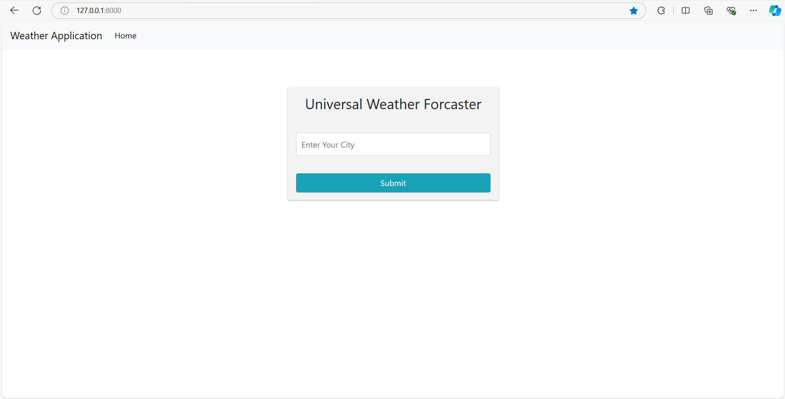
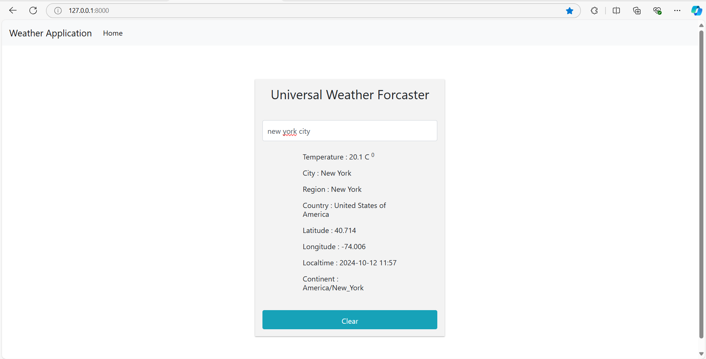

# Django Weather Application

Here's a simple weather application built with Python (Django). You're welcome to customize it according to your needs.


## Pre-Requisites:

1. Install the latest version of Python [ https://www.python.org/downloads/ ]

2. Install the latest version of Django either globally or within a dedicated virtual environment
```bash
pip install django
```

3. Install Requests Library
```bash
pip install requests
```

4. Sign up for a free account at [weatherapi.com](https://www.weatherapi.com/), log in, and generate your new API key in the dashboard section.

5. After generating your API key, copy it and then paste it into the "API_KEY" variable within the views.py file using this format:
```bash
API_KEY = 'paste-your-api-key'
```

## How to run this project?

**Clone this project**
```
git clone
```

**Then, Enter the project directory**
```
cd Weather-Application-Django
```

**Activate Virtual Environment, if you don't have an environment, please don't follow this steps.**

For Windows
```
source venv/scripts/activate
```

For Linux and Mac
```
source venv/bin/activate
```

**Install Requirements from 'requirements.txt'**
```python
pip install -r requirements.txt
```

**6. Now Run Server**

Command for Windows:
```python
python manage.py runserver
```

Command for Linux or Mac:
```python
python3 manage.py runserver
```
### Weather Forcaster



